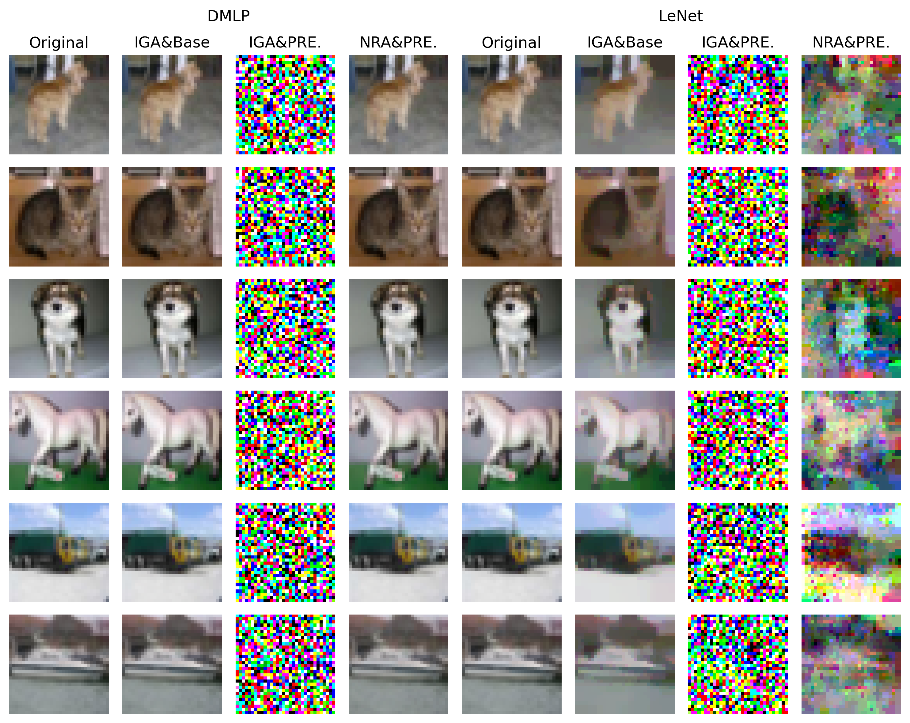
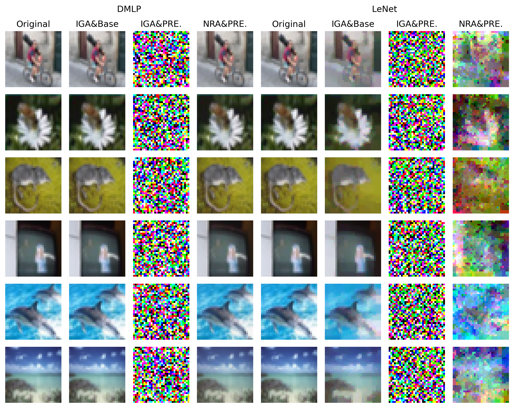
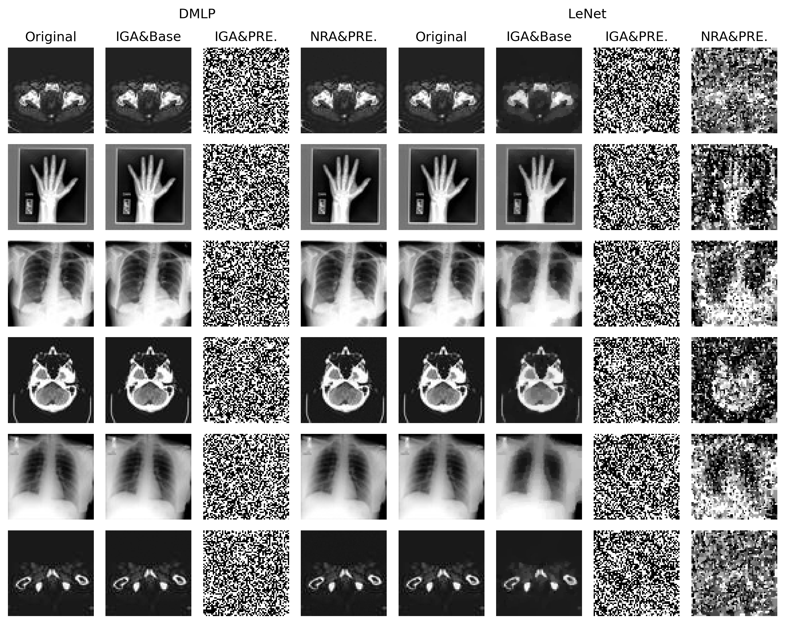

# NRA: Noise-Restoring Attack against
This repository contains the implementation of NRA based on IGA as well as an example jupyter notebook where the NRA is used. Besides, visualizations of some experimental results are shown here. 

Examples of exemplary reconstruction results of CIFAR-10 dataset for the baseline DMLP and LeNet models and different attack&defense:

  

Examples of exemplary reconstruction results of CIFAR-100 dataset for the baseline DMLP and LeNet models and different attack&defense:

  

Examples of exemplary reconstruction results of Medical MNIST dataset for the baseline DMLP and LeNet models and different attack&defense:

  

Neural networks are trained on CIFAR-10, CIFAR-100, and Medical MNIST. During training, gradients are used for inversion attacks aiming to reconstruct original training data. Without defense (Original Model), training data can be entirely reconstructed. Noisy gradients prevent reconstruction to some extent but reduce model performance. PRECODE extension is believed to entirely prevents reconstruction without impacting the training process. Though PRECODE seems promising, we found that it still leads to privacy leakage in our research.

## Abstract:
Federated learning is a method for training models without sharing data to protect users' data privacy. However, it has been shown that the gradient-sharing-only approach of federated learning can still lead to the leakage of training data. Recent work proposed a *PRivacy EnhanCing mODulE* (PRECODE) as a general extension to arbitrary model structures. It can effectively prevent privacy leakage from gradients by random sampling due to variational modeling. In this paper, we propose a variational **N**oise-**R**estoring **A**ttack (NRA) against PRECODE to reconstruct the original input, and further derive its mechanism for privacy leakage. In addition, using a federated recommender system scenario as an example, we investigate the privacy-preserving capability of PRECODE in other domain tasks. Finally, we conduct an extensive empirical study on three important models and three commonly used image classification datasets in the field of computer vision, as well as FedVAE and three publicly available recommendation datasets in recommender systems. The results show that PRECODE is likely to lead to privacy leakage on easy models and simple inputs, and combining PRECODE with other architectures having some privacy-preserving capability might achieve better privacy protection.

## Requirements:
+ pytorch
+ torchvision
+ scikit-image

## Credits:
We use the attack of Geiping et al. ([arXiv](https://arxiv.org/abs/2003.14053), [GitHub](https://github.com/JonasGeiping/invertinggradients)).

We use the PRECODE of Scheliga et al. ([Paper](https://openaccess.thecvf.com/content/WACV2022/papers/Scheliga_PRECODE_-_A_Generic_Model_Extension_To_Prevent_Deep_Gradient_WACV_2022_paper.pdf), [GitHub](https://github.com/dAI-SY-Group/PRECODE)).

We use the FedVAE of Polato. ([Paper](https://ieeexplore.ieee.org/abstract/document/9533358), [Colab](https://colab.research.google.com/drive/1sOx8QZYwRoEvOc6kBiQnVqZNVdbAEofM?usp=sharing)).
